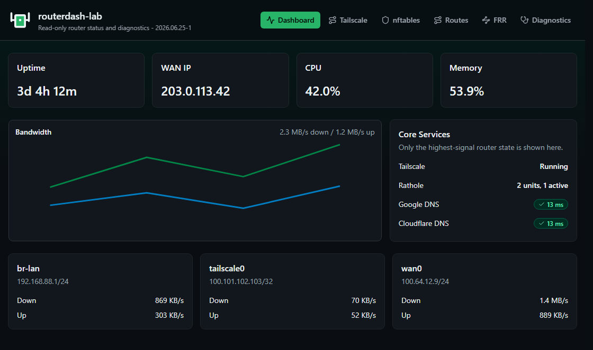

<p align="center">
  
</p>

<h1 align="center">RouterDash</h1>

<p align="center">
  A compact, read-only web dashboard and diagnostics console for Linux routers.
</p>

<p align="center">
  
  
  
  
</p>



RouterDash is a single Go binary that runs on a Linux router as a systemd service.
It serves an embedded SvelteKit web UI, gathers local router status through normal
system tools, and exposes a small set of bounded network diagnostics.

It is meant for trusted LAN use: quick router state, routes, firewall output,
Tailscale details, FRR summaries, and simple ping/MTR checks without SSHing into
the router every time.

## What It Shows

RouterDash keeps the main dashboard intentionally small:

- hostname and version
- uptime
- WAN IP
- CPU and memory usage
- browser-local bandwidth chart
- interface cards with addresses and live rates
- Tailscale headline state
- rathole service state from matching systemd units
- low-noise reachability checks for Google and Cloudflare DNS

Detailed pages are available for:

- Tailscale status, advertised routes, peers, received routes, and route acceptance
- nftables or iptables configuration, view-only
- all installed route tables with server-side pagination
- FRR OSPF/BGP summaries and running config output
- ping and MTR diagnostics

## What It Does Not Do

RouterDash does not configure your router.

It does not:

- change nftables, iptables, routes, FRR, Tailscale, or rathole settings
- act as a firewall manager
- replace Prometheus, Netdata, Grafana, or long-term monitoring
- store bandwidth history server-side
- authenticate users
- safely expose itself to the public internet by default

The diagnostics page can run only bounded `ping` and `mtr` commands. MTR is always
called as:

```sh
mtr -r -b -w -c10 <target>
```

## Runtime Requirements

RouterDash expects a Linux host with systemd. It shells out to tools already
present on the router and hides or marks unavailable data when optional tools are
missing.

Common tools:

- `ip`
- `curl`
- `ping`
- `mtr`
- `systemctl`
- `tailscale`
- `nft`
- `iptables-save`
- `vtysh`

The binary itself has the web UI embedded, so there is no Node.js or pnpm
dependency on the router.

## Install From A Release

Download the release tarball that matches your router architecture. Most x86_64
routers use `linux-amd64`; many ARM routers use `linux-arm64`.

```sh
tar -xzf routerdash-YYYY.MM.DD-N-linux-amd64.tar.gz
install -m 0755 routerdash /usr/local/bin/routerdash
install -m 0644 routerdash.service /etc/systemd/system/routerdash.service
systemctl daemon-reload
systemctl enable --now routerdash.service
```

By default the service listens on port `8080`:

```text
http://router-address:8080/
```

To change the bind address, edit `ROUTERDASH_ADDR` in:

```text
/etc/systemd/system/routerdash.service
```

Then reload and restart:

```sh
systemctl daemon-reload
systemctl restart routerdash.service
```

Check the service:

```sh
systemctl status routerdash.service
curl http://127.0.0.1:8080/api/version
```

## Build Locally

Use mise for every project command.

```sh
mise run setup
mise run check
mise run pack
```

Useful tasks:

```sh
mise run format
mise run screenshots
mise run screenshots:dark
mise run screenshots:light
mise run build-local
mise run pack-arm64
mise run version
mise run version-bump
```

Packages are written to `dist/`:

```text
routerdash-linux-amd64.tar.gz
routerdash-YYYY.MM.DD-N-linux-amd64.tar.gz
routerdash-linux-arm64.tar.gz
routerdash-YYYY.MM.DD-N-linux-arm64.tar.gz
```

## Fake Harness

Local tests and screenshots do not require router binaries. Set `ROUTERDASH_FAKE=1`
to use deterministic fake command output.

PowerShell example:

```powershell
mise run build-local
$env:ROUTERDASH_FAKE = "1"
$env:ROUTERDASH_ADDR = "127.0.0.1:18082"
.\dist\routerdash.exe
```

Then open:

```text
http://127.0.0.1:18082/
```

## Versioning

The project version lives in `VERSION` and uses:

```text
YYYY.MM.DD-N
```

Builds stamp the version into the Go binary and expose it through:

```text
GET /api/version
```

GitHub Actions runs the full check gate and only packages versioned artifacts
when that version does not already exist as a GitHub release.

## Security Model

RouterDash is intended for trusted internal networks or access through your own
reverse proxy/VPN. It has no built-in authentication and should not be published
directly to the public internet.

The app is read-only for router configuration, but diagnostics still execute
bounded network commands. Keep access limited to operators you trust.
